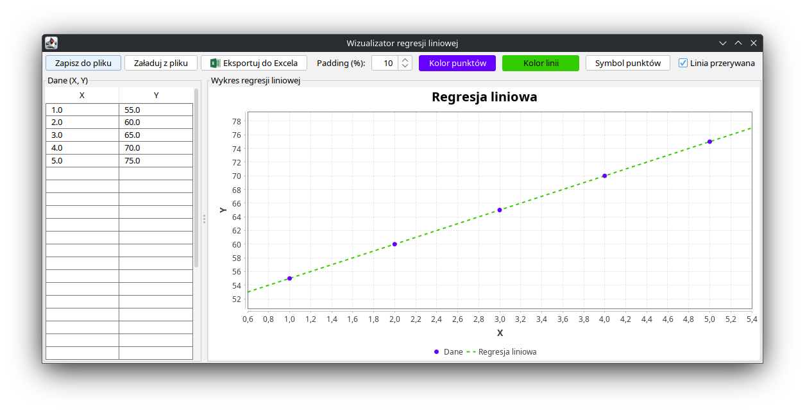

<div align="center">

# 📊 Linear Regression Visualizer

[](https://opensource.org/licenses/MIT)
[](https://openjdk.java.net/)

</div>

> Modern Java Swing application for visualizing linear regression. Enter data points in a table and watch the regression line update dynamically in real-time.

> **Note:** This project was originally created for personal use, which is why the user interface is in Polish. However, it has been made publicly available so anyone can use and benefit from it.




---

## 📋 Table of Contents

- [Features](#-features)
- [Requirements](#-requirements)
- [Quick Start](#-quick-start)
- [Usage](#-usage)
- [License](#-license)

---

<div align="center">

## 🎉 What's New

### 📊 Excel Export Support

Export your data and regression analysis directly to **Excel (.xlsx)** files! 

### ✨ **Features:**

📈 **Visual Charts** - Automatically generated scatter plots with regression lines

📋 **Data Sheets** - Complete data tables with all your X and Y values

📊 **Regression Parameters** - Detailed regression statistics (intercept, slope, R²)

🎨 **Professional Formatting** - Ready-to-present Excel files with styled charts

`The exported Excel files include both raw data and beautiful visualizations, making it perfect for reports and presentations!`

</div>

---

## ✨ Features

- 📈 **Dynamic Chart** - Real-time linear regression visualization
- 📝 **Data Table** - 30 rows for X and Y values with editable cells
- 🎨 **Modern UI** - Beautiful FlatLaf Light theme interface
- 💾 **Save/Load** - Export and import data as JSON files
- 🖱️ **Drag & Drop** - Move values between cells by dragging
- ⌨️ **Delete Support** - Clear cells with Delete/Backspace keys
- 📊 **Auto Calculation** - Automatic regression line calculation (minimum 2 points)
- 🟢 **Colors Selection** - Customizable colors for data points and regression line
- 💫 **Symbol Selection** - Choose your favourite symbol for data points
- 📐 **Excel Export** - Export data and charts to Excel (.xlsx) files

---

## 📦 Requirements

- **Java**: 11 or higher
- **Build Tool**: Gradle (for building from source)

---

## 🚀 Quick Start

### Running the Application

1. Download the latest release JAR file
2. Run with Java:
   ```bash
   java -jar linear-regression-visualizer-1.0-SNAPSHOT.jar
   ```

### Building from Source

1. Clone the repository:
   ```bash
   git clone https://github.com/neziw/linear-regression-visualizer.git
   cd linear-regression-visualizer
   ```

2. Build the project:
   ```bash
   ./gradlew build
   ```

3. Run the application:
   ```bash
   ./gradlew run
   ```

---

## 💻 Usage

### Entering Data

1. Click on any cell in the X or Y column
2. Enter a numeric value
3. The chart updates automatically when you have at least 2 valid data points

### Managing Data

- **Delete Values**: Select cells and press `Delete` or `Backspace`
- **Move Values**: Select cells, drag to another location, and drop
- **Save Data**: Click "Zapisz do pliku" to save data as JSON (includes chart settings)
- **Load Data**: Click "Załaduj z pliku" to load data from JSON file
- **Export to Excel**: Click "Eksportuj do Excela" to export data and charts to Excel (.xlsx)

### Chart Features

- Blue dots represent data points
- Red line shows the calculated linear regression
- Chart automatically scales to fit all data points

---

## 📄 License

This project is licensed under the MIT License - see the [LICENSE](LICENSE) file for details.

---

## 🙏 Acknowledgments

- Built with [JFreeChart](https://www.jfree.org/jfreechart/) for chart visualization
- GUI powered by [FlatLaf](https://www.formdev.com/flatlaf/)
- JSON handling with [Gson](https://github.com/google/gson)
- Excel export powered by [Apache POI](https://poi.apache.org/)

---

**Made with ❤️ by [neziw](https://github.com/neziw)**
